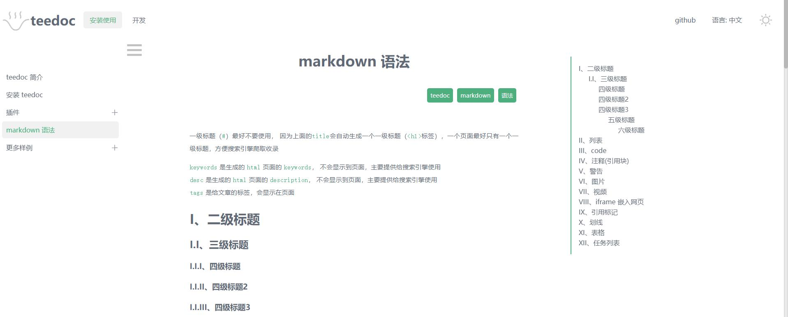

teedoc
=====

官网: [teedoc.github.io](https://teedoc.github.io/)

将 `Markdown` 或者 `Jupyter Notebook` 格式的文档转换为 `HTML` 网页




## Features

- [x] 使用简单， 跨平台，只依赖 `Python3`
- [x] 书写简单，使用 Markdown 语法编写
- [ ] Jupyter notebook 支持
- [x] 多文档支持
- [x] 插件支持
- [x] 多主题支持（由插件实现）
- [x] 多级目录支持
- [x] 多语言支持（手动翻译）
- [ ] 多语言支持（自动翻译）
- [x] 多版本支持（实现方法同多语言）
- [ ] 搜索支持
- [x] SEO 友好
- [x] 实时预览更改
- [ ] 博客支持


## 使用方法

需要先安装`Python3` （仅仅支持 `Python3`）

比如在`Ubuntu`上：
```
sudo apt install python3 python3-pip
```

`Windows` 和 `macOS`请到[官网下载](https://www.python.org/downloads/)


### 安装

打开终端，输入：

```
pip3 install teedoc
```

使用以下命令来更新软件：
```
pip3 install teedoc --upgrade
```

现在你可以在终端使用 `teedoc` 命令了

如果不能，请检查是不是`Python`可执行目录没有加入到环境变量 `PATH`,
比如可能在 `~/.local/bin`


### 构建网页

* 获取文档模板工程

```
git clone https://github.com/teedoc/teedoc.github.io my_site
```

* 安装插件

```
cd my_site
teedoc install
```

* 构建 `HTML` 页面并起一个`HTTP`服务

```
teedoc serve
```

在显示 `Starting server at 0.0.0.0:2333 ....` 后，就可以了

打开浏览器访问: [http://127.0.0.1:2333](http://127.0.0.1:2333)

或者仅仅构建文档
```
teedoc build
```
在`out`目录下可以看到生成的网站


## 更多请到 [teedoc.github.io](https://teedoc.github.io/)
